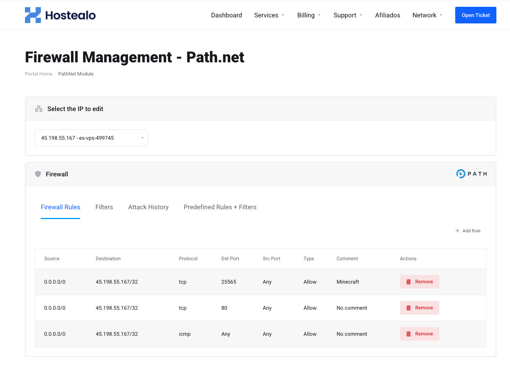
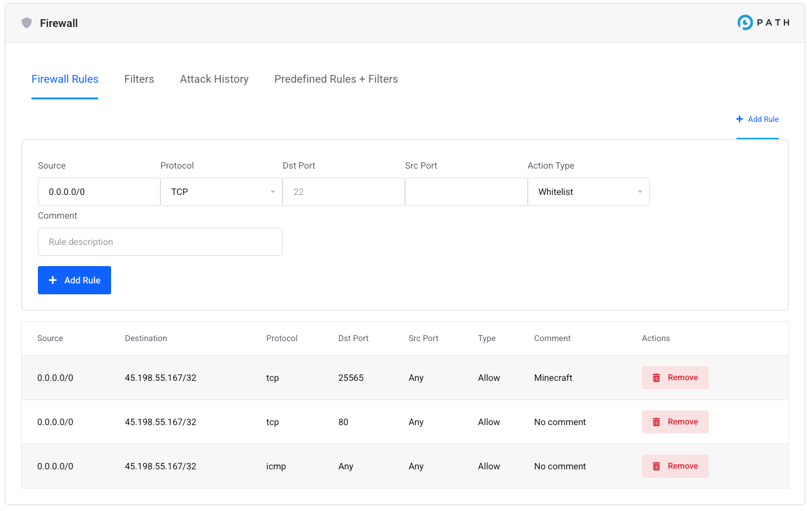
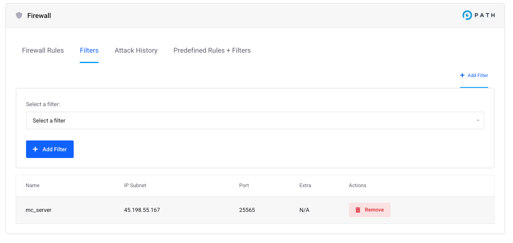
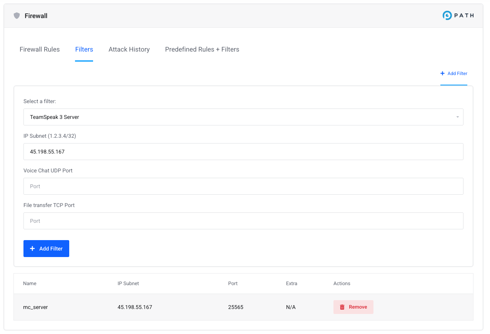
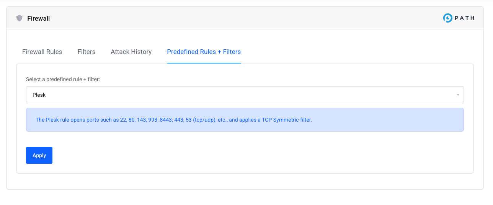

# Path.net Module for WHMCS

This project integrates the [Path.net API](https://path.net) with WHMCS, allowing you to manage firewall rules, filters, and view attack history directly through your WHMCS interface.

## Features

- **Firewall Rules Management**
  - **List Rules:** Retrieve the current firewall rules for a given IP.
  - **Add Rule:** Create new firewall rules using the Path.net API.
  - **Delete Rule:** Remove firewall rules by specifying their unique rule ID.

- **Filters Management**
  - **List Available Filters:** Fetch the list of available filters from the Path.net API.
  - **Add Filter:** Apply a filter to a specific IP address.
  - **Current Filters:** View all filters that are currently applied to an IP.
  - **Delete Filter:** Remove a filter using its ID and name.

- **Attack History**
  - **Retrieve Attack History:** Get historical attack data for an IP address to help monitor potential threats.

- **IP Ownership Verification**
  - **Secure Access:** Before any action, the module verifies that the current WHMCS user owns the IP address through WHMCS’s internal API, ensuring only authorized changes are made.
 
## Screenshots






## Installation

1. **Clone the Repository**

   Clone or download the repository into your WHMCS /modules/addons/ directory.

2. **Configure API Key**

   Open the `ajax.php` file and go to line 8. Replace the placeholder API key with your actual Path.net API key:
   ```php
   $api_key = "YOUR_PATHNET_API_KEY_HERE";
   ```

3. **Set the IP Range**

   Open the `pathnet_module.php` file and locate lines 54 and 64. Configure these lines to specify the IP range for your deployment.  
   For example, if your IP range starts with `45.`, set these lines to cover that entire range (e.g., all IPs starting with `45.`).

4. **Ensure WHMCS Compatibility**

   - Make sure your WHMCS installation is properly configured.
   - Verify that the server has cURL enabled in PHP to handle API requests.

## Usage

The module provides several AJAX actions that can be triggered from within WHMCS:

- **getRules:** Retrieves the current firewall rules for a specified IP.
- **addRule:** Adds a new firewall rule. The request must include a `ruleData` parameter that matches the destination IP.
- **deleteRule:** Deletes a firewall rule by its `ruleId`.
- **getFilters:** Fetches a list of available filters from the API.
- **addFilter:** Applies a filter to the IP. The `filterData` must include an `addr` that matches the specified IP.
- **getCurrentFilters:** Lists all filters currently applied to the IP.
- **deleteFilter:** Deletes a filter by providing both the `filterId` and `filterName`.
- **attackHistory:** Retrieves the attack history for the specified IP.

## Theme Compatibility

The module is optimized for the **Lagom2** theme. If you are using another theme, additional modifications may be required in the `templates/overview.tpl` file to ensure proper display and functionality.

## Security Considerations

- **API Key Protection:**  
  Ensure your Path.net API key is kept secure and not exposed publicly.
  
- **Access Control:**  
  The module verifies IP ownership using WHMCS’s `localAPI`, so only authorized users can modify or view data related to their IP addresses.
  
- **Data Validation:**  
  Validate all inputs appropriately when integrating or extending the module.

## Contributing

Contributions, issues, and feature requests are welcome! Please feel free to fork the repository and submit pull requests.

## License

This project is licensed under the [MIT License](LICENSE).

